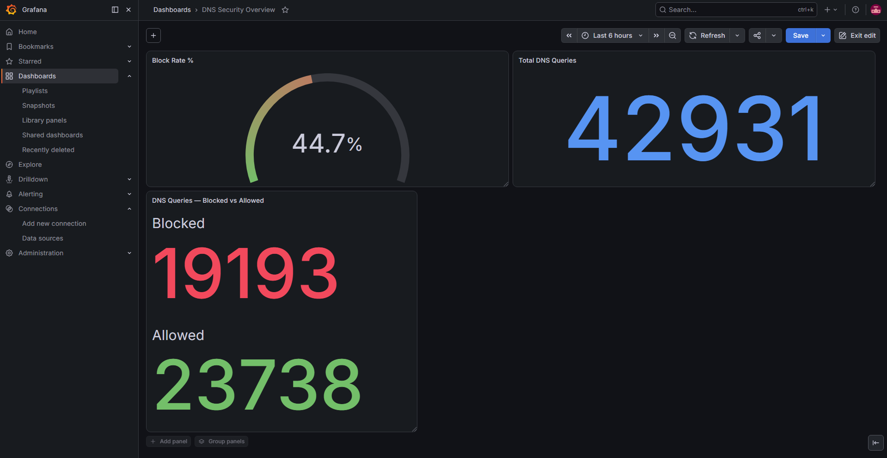
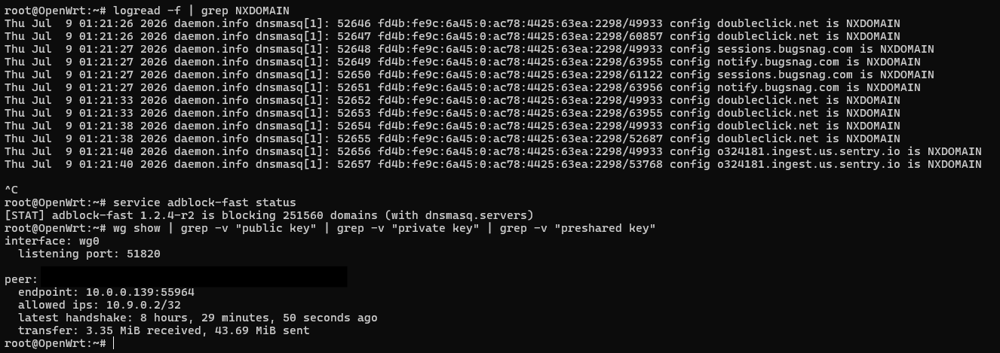

# Home Network Security Stack — Raspberry Pi 4

A self-hosted network security stack built on a Raspberry Pi 4 running OpenWrt. This project transforms a $35 single-board computer into a full router with DNS-based ad/malware blocking, a self-hosted WireGuard VPN server, dynamic DNS, remote access via Tailscale, and a real-time Grafana monitoring dashboard.



## Live Stats

- **251,560+ domains blocked** across the entire network
- **~45% of all DNS queries** intercepted and blocked (ads, trackers, malware)
- **Zero per-device configuration** — every device on the network is protected automatically
- **Encrypted remote access** from anywhere via self-hosted WireGuard VPN

## Architecture

```
Internet
    |
ISP Router (10.0.0.1)
    |
    | ethernet
    |
eth0 (WAN) ─── Raspberry Pi 4 (OpenWrt) ─── eth1 (LAN, USB adapter)
    |                   |                          |
    |                   |                     Local Devices
    |                   |                     (192.168.1.x)
    |                   |
WireGuard VPN     Tailscale (backdoor)
(UDP 51820)
    |
Remote Devices
(phones, laptops)
```

| Interface | Role | Address |
|---|---|---|
| eth0 | WAN (upstream) | DHCP from ISP router |
| eth1 | LAN (USB adapter) | 192.168.1.1/24 static |
| wg0 | WireGuard VPN | 10.9.0.1/24 |
| tailscale0 | Tailscale | 100.x.x.x |

## Components

| Component | Purpose |
|---|---|
| **OpenWrt** | Linux router firmware — full control over firewall, DNS, routing |
| **adblock-fast** | DNS-level blocking of ads, trackers, and malware domains |
| **WireGuard** | Self-hosted VPN server with public-key cryptography |
| **DuckDNS** | Dynamic DNS — VPN stays reachable when the ISP rotates the public IP |
| **Tailscale** | Independent remote-access backdoor, immune to local misconfiguration |
| **Prometheus** | Metrics collection from the Pi (system + dnsmasq exporters) |
| **Grafana** | Real-time dashboard: block rate, DNS traffic, system health |

## Security Hardening

- SSH key-only authentication (password auth disabled)
- SSH blocked from WAN entirely
- Forced DNS redirection — clients cannot bypass the DNS filter with their own resolvers (e.g. 8.8.8.8)
- WireGuard peers isolated in a dedicated firewall zone
- Dynamic DNS updates over HTTPS

## Screenshots

**Live DNS blocking + WireGuard handshake**



Live terminal showing `doubleclick.net`, `sessions.bugsnag.com`, and other tracking domains being answered with NXDOMAIN in real time, plus an active WireGuard tunnel with transfer statistics.

## Hardware

| Item | Notes |
|---|---|
| Raspberry Pi 4 (2GB) | 4GB+ recommended but 2GB works fine |
| MicroSD card | Class 10 / A1 minimum |
| USB 3.0 Gigabit ethernet adapter | ASIX AX88179 chipset recommended (in-kernel driver on OpenWrt) |
| 2x ethernet cables | WAN to ISP router, LAN to PC/switch |

## Documentation

- **[SETUP.md](SETUP.md)** — complete step-by-step installation guide
- **[TROUBLESHOOTING.md](TROUBLESHOOTING.md)** — every issue hit during the build and how it was fixed

## Repo Layout

```
.
├── README.md
├── SETUP.md
├── TROUBLESHOOTING.md
├── wireguard/
│   ├── wg0.conf.example        # server config template
│   └── client.conf.example     # client config template
├── prometheus/
│   └── prometheus.yml          # Prometheus scrape config
├── scripts/
│   └── ddns-update.sh          # DuckDNS updater (cron, every 5 min)
└── screenshots/
```

## Skills Demonstrated

Linux networking (interfaces, routing, UCI) · DNS architecture and filtering · Public-key cryptography and VPN tunneling · Firewall zones, NAT, and port forwarding · Dynamic DNS · SSH hardening · Docker · Prometheus/Grafana observability · Protocol-level troubleshooting

## License

MIT
